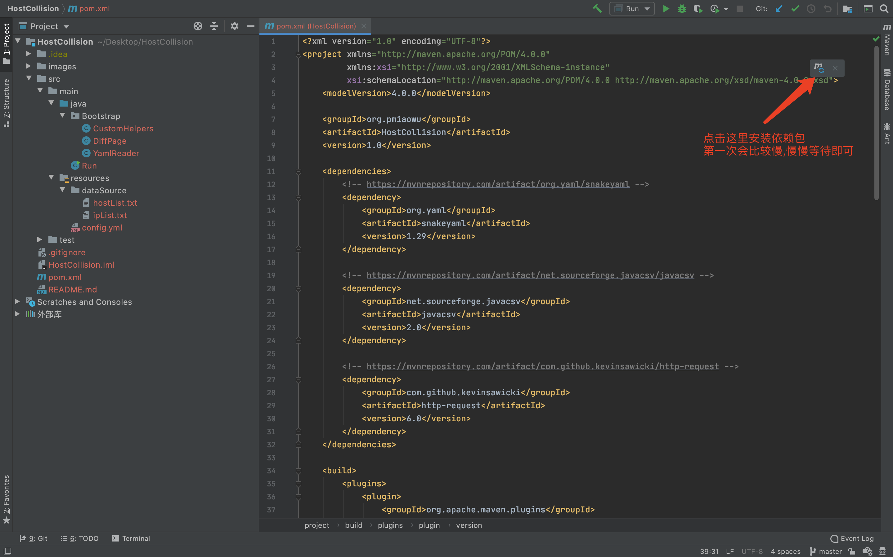
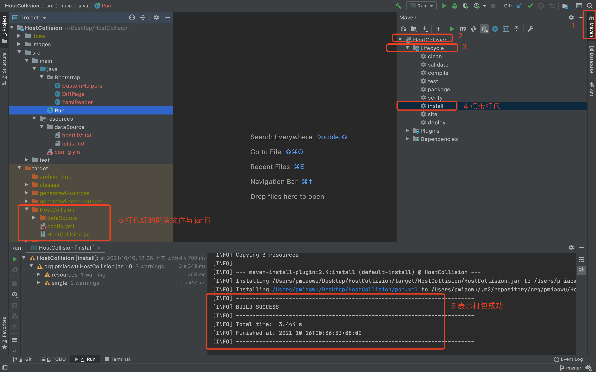
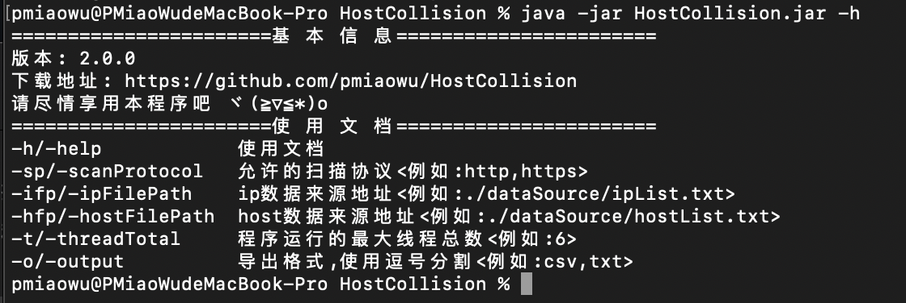
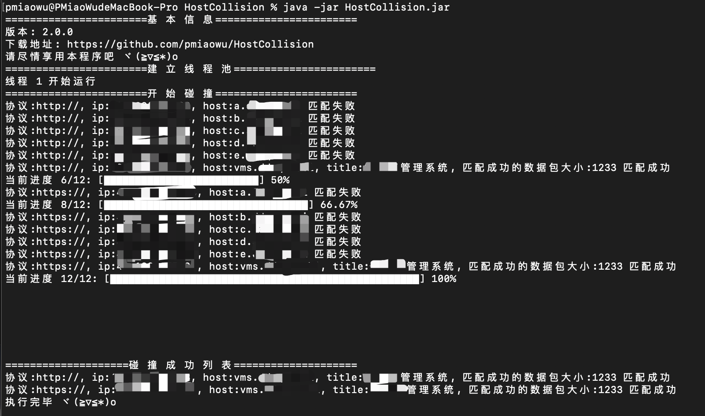

# 0x01 HostCollision
用于host碰撞而生的小工具,专门检测渗透中需要绑定hosts才能访问的主机或内部系统

# 0x02 自言自语
写这个工具最主要是因为作者自己的使用问题还有解决一些特殊情况下的误报问题,于是它就诞生了 :)

# 0x03 编译方法

<details>
<summary><b>编译方法</b></summary>

这是一个 java maven项目

java版本为 1.8

导入idea,打开刚刚好下载好的源码


打开: /HostCollision/pom.xml 安装对应的包,第一次安装依赖包需要比较久,慢慢等不要急





编译文件地址: /HostCollision/target/HostCollision/

jar包地址: /HostCollision/target/HostCollision/HostCollision.jar

项目配置文件地址: /HostCollision/target/HostCollision/config.yml

接着拿着这个 HostCollision.jar 进行使用即可

</details>

# 0x04 使用方法

<details>
<summary><b>使用方法</b></summary>

```
# 目录结构
├── HostCollision
│   ├── HostCollision.jar (主程序)
│   ├── config.yml (配置文件,保存着程序各种设置)
│   └── dataSource (程序进行host碰撞的数据来源)
│     ├── ipList.txt (输入ip地址,一行一个目标)
│     └── hostList.txt (输入host地址,一行一个目标)
```

```
读取 ipList.txt 和 hostList.txt 进行遍历匹配访问

命令: java -jar HostCollision.jar

执行完毕以后会在根目录生成一个 年-月-日_8位随机数.csv 文件
里面会保存碰撞成功的结果

没事可以看看 config.yml 文件, 里面保存了程序的各种配置
```

扫描结果





</details>